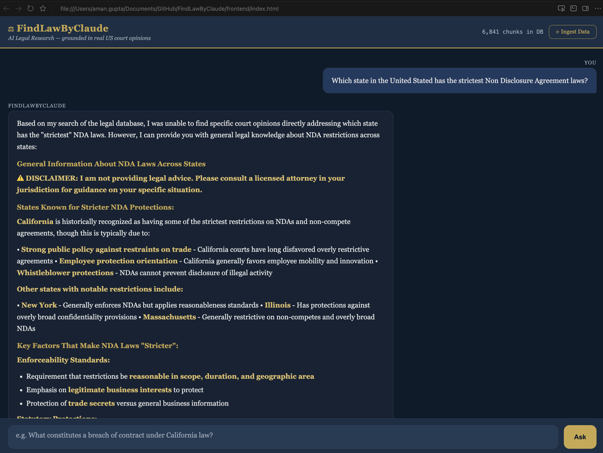
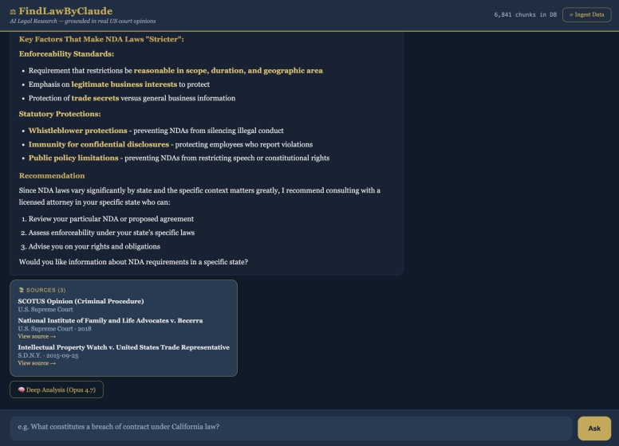
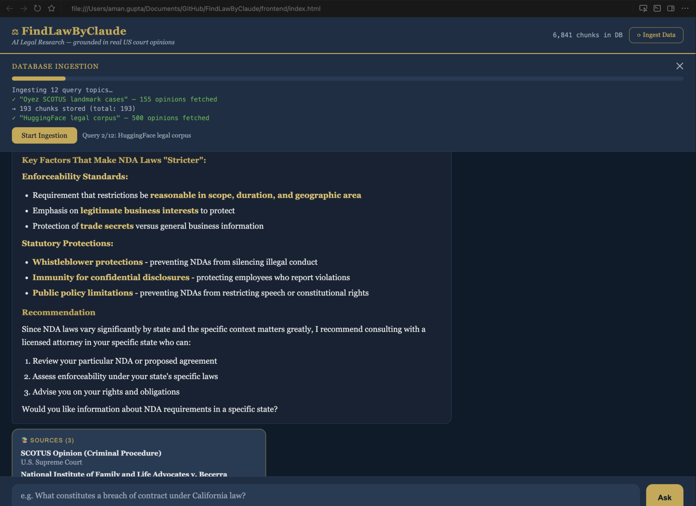

# ⚖️ FindLawByClaude

> **AI legal research grounded in real US court opinions — not hallucinations.**

Ask a legal question in plain English. Get an answer backed by actual precedent, with clickable citations to the real case. For the 80% of Americans who can't afford a lawyer.

**Built at:** Carnegie Mellon University · *Claude Builder Club × CMUAI Hackathon* · April 18, 2026  
**Theme:** [Creative Flourishing](https://www.anthropic.com/news/machines-of-loving-grace) — democratizing access to legal knowledge

---

## Demo

**Ask a question, get a cited answer in ~3 seconds:**



**Sources panel — every claim links to the real case:**



**Live database ingestion panel — pull from Oyez, CourtListener, and Harvard CAP:**



---

## The Problem

Legal information is gatekept behind $300/month paywalls (Westlaw, LexisNexis). Most people — tenants facing eviction, employees questioning an NDA, creators worried about fair use — can't afford a lawyer just to understand their rights.

**The alternative is worse:** ChatGPT invents citations that don't exist. Google returns SEO blogspam. Neither tells you what the actual court said.

FindLawByClaude changes that. Every answer is grounded in real court opinions retrieved from a vector database, with citations you can click and verify.

---

## How It Works

Two modes, one interface:

### Fast Mode — Claude Haiku 4.5 (~3 seconds)
Ask a question → Claude searches a local vector DB of real US court opinions → returns a markdown answer with cited cases.

### Deep Analysis — Claude Opus 4.7 (~25 seconds)
Click "🧠 Deep Analysis" on any answer → Opus 4.7 with extended thinking performs a senior-partner-quality **IRAC analysis** (Issue → Rule → Application → Conclusion) with visible chain-of-thought reasoning.

```
Architecture:

User question
     │
     ├──► POST /ask  ──► Claude Haiku 4.5 + tool-use loop
     │                   └─► search_legal_database(query)
     │                        └─► ChromaDB (cosine similarity, MiniLM-L6-v2)
     │                             └─► Oyez SCOTUS + CourtListener + Harvard CAP
     │
     └──► POST /deep ──► Claude Opus 4.7 + extended thinking
                         ├─► top-8 case retrieval (deduplicated by opinion)
                         └─► <thinking> chain + IRAC answer + sources
```

---

## Data Sources

All free, no paid APIs:

| Source | Cases | Access |
|--------|-------|--------|
| **Oyez API** | ~300 SCOTUS landmark cases (1953–2023) | Free, no auth |
| **CourtListener** | Thousands of federal/state opinions | Free search API |
| **Harvard Caselaw Access Project** | State supreme court opinions | Free HuggingFace datasets |
| **HuggingFace legal datasets** | 500+ case law reports | Free, no auth |

The in-browser **Ingest Data** panel lets you pull fresh data at any time with live progress streaming.

---

## Quick Start

```bash
# 1. Clone and install
git clone https://github.com/a-man-gupta/FindLawByClaude
cd FindLawByClaude
python -m venv venv && source venv/bin/activate
pip install -r requirements.txt

# 2. Configure (one key needed)
cp .env.example .env
# Edit .env: OPENROUTER_API_KEY=sk-or-v1-...

# 3. Populate the vector database
python src/ingest.py          # ~5 min — Oyez + CourtListener + HuggingFace

# 4. Start the API
uvicorn src.api:app --reload --port 8000

# 5. Open the frontend
open frontend/index.html
```

---

## API

| Endpoint | Purpose | Latency |
|----------|---------|---------|
| `POST /ask` | Fast Q&A — Haiku 4.5 + tool use | ~3s |
| `POST /deep` | IRAC analysis — Opus 4.7 + extended thinking | ~25s |
| `POST /ingest` | SSE-streamed database ingestion | minutes |
| `GET /stats` | Chunk count in DB | <1s |
| `GET /health` | Liveness | <1s |

Both `/ask` and `/deep` accept `{ "question": "..." }` and return `{ "answer", "sources" }`.  
`/deep` additionally returns `"thinking"` (the visible reasoning chain) and `"model"`.

---

## Tech Stack

| Layer | Technology |
|-------|-----------|
| LLM | Claude Haiku 4.5 (fast) · Claude Opus 4.7 (deep reasoning) |
| LLM Gateway | OpenRouter — OpenAI-compatible SDK |
| Backend | FastAPI + uvicorn |
| Vector DB | ChromaDB (persistent, cosine similarity) |
| Embeddings | sentence-transformers `all-MiniLM-L6-v2` (local CPU) |
| Frontend | Vanilla HTML/CSS/JS + marked.js |
| Data | Oyez API · CourtListener · Harvard CAP · HuggingFace |

---

## Why "Creative Flourishing"

Dario Amodei's essay describes a future where AI helps strengthen democracy and give people agency over their own lives:

> *"A truly mature and successful implementation of AI has the potential to reduce bias and be fairer for everyone... AI could be used to help provision government services... Having a very thoughtful and informed AI whose job is to give you everything you're legally entitled to."*

Legal literacy is one of the deepest forms of civic empowerment. When people can read the cases that govern their rights — not paywalled summaries, not hallucinated citations — they gain real agency.

FindLawByClaude is that tool. Not a lawyer replacement. A first step that actually works.

---

## Honesty Guarantees

1. **No fabricated citations** — the system prompt explicitly forbids inventing cases. If a case isn't in the retrieved results, the model says so.
2. **Jurisdictional honesty** — state-law questions trigger a clarifying note instead of a guessed holding.
3. **Always disclaim** — every response ends with a non-legal-advice disclaimer.

---

## Project Structure

```
.
├── src/
│   ├── api.py        # FastAPI routes: /ask, /deep, /ingest, /stats, /health
│   ├── rag.py        # ChromaDB retrieval + OpenAI tool spec for Claude
│   └── ingest.py     # Oyez + CourtListener + HuggingFace + Harvard CAP loaders
├── frontend/
│   └── index.html    # Chat UI, deep analysis button, ingest panel
├── demo/             # Screenshots
├── requirements.txt
├── .env.example
└── CLAUDE.md
```

---

> **Disclaimer:** Research and education tool only. Not a substitute for licensed legal counsel. Always verify citations before relying on them.
